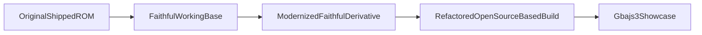

# @rkanoid Modernization Plan

## Goal

Use the now-working faithful lane as the authoritative base for future modernization, preserving behavior first and then gradually refactoring toward a clean modern GBA codebase with publicly available open-source tooling and libraries.

## Updated strategy

The implementation should now proceed from:

- `faithful-first`
- using the faithful lane as the canonical working branch for further iterations
- broader open-source adoption only after behavior remains stable on top of that faithful base

## Base of record

Use these lanes with the following roles:

- `public/roms/@rkanoid LATEST - DEMO.gba` as original reference ROM
- `@rkanoid/build/faithful/work` as the main working codebase for ongoing modernization
- `@rkanoid/build/modern/work` as an experimental lane only when needed for comparison or isolated tests

That means future fixes should be applied to the faithful lane first, unless a change is explicitly exploratory.

## Phase 1: Stabilize and protect the faithful lane

Treat `[@rkanoid/build/faithful/work]( /Users/benoror/code/benoror/gbadev/@rkanoid/build/faithful/work )` as the active modernization base.

Tasks:

- preserve the startup/data-init fixes already learned
- preserve the reconstructed/recovered assets that improved behavior
- preserve the reduced libc/runtime drift changes
- keep validating against the original shipped ROM for visuals, gameplay, and timing
- document each behavior-preserving fix in `build/faithful/attempt-*.md`

Success criteria:

- faithful lane remains the closest known working rebuild
- future work does not regress sprite/background/title/menu/gameplay behavior relative to current faithful state

## Phase 2: Build a reproducible modern toolchain around the faithful lane

Modernize the build while keeping the faithful code behavior as the baseline.

Preferred stack:

- `devkitARM`
- `libgba`
- `mGBA` for validation/debugging
- `gbajs3` only for showcase/distribution

Open-source references gathered during research:

- [devkitARM](https://devkitpro.org/wiki/devkitARM)
- [libgba](https://github.com/devkitPro/libgba)
- [Tonc setup docs](https://gbadev.net/tonc/setup.html)
- [grit manual](https://www.coranac.com/man/grit/html/grit.htm)
- [grit source](https://github.com/devkitPro/grit)
- [mGBA](https://mgba.io/)
- [gba-toolchain (CMake)](https://github.com/felixjones/gba-toolchain)
- [meson-gba](https://github.com/LunarLambda/meson-gba)
- [gba-bootstrap](https://github.com/AntonioND/gba-bootstrap)
- [gbajs3](https://github.com/thenick775/gbajs3)
- [awesome-gbadev](https://github.com/gbadev-org/awesome-gbadev)

Tasks:

- replace ad-hoc local toolchain assumptions with a documented public toolchain path
- keep the faithful ROM behavior stable while swapping build infrastructure underneath it
- maintain `.elf`, `.map`, and ROM outputs for debugging and comparison

## Phase 3: Introduce open-source libraries/tools selectively

Use broader library adoption, but only where it clearly improves maintainability without changing behavior.

Recommended order:

1. `libgba` for standardized headers/build/runtime glue where appropriate
2. `grit` for reproducible asset generation from preserved BMP sources
3. selective `tonc` helpers for DMA/OAM/input/math utilities if they replace fragile handwritten code cleanly
4. avoid full engine-style migration in the first pass

Use the faithful lane as the source of truth when deciding whether an adoption is acceptable.

## Phase 4: Refactor structure while preserving behavior

After the build and asset flow are stable:

- stop including `.c` files into other `.c` files
- separate declarations and definitions into headers and compilation units
- isolate hardware/runtime code from gameplay code
- keep preserved historical snapshots untouched in `current/` and `legacy/`

This phase should operate on a derivative of the faithful lane, not by mutating the preserved original snapshot directly.

## Phase 5: Translate naming/comments into modern English-based code style

Add a final cleanup pass focused on readability and maintainability.

Scope:

- translate rough Spanish variable/function names into clearer English-oriented identifiers
- translate comments/documentation into concise modern English
- keep gameplay behavior unchanged
- preserve a mapping/reference document for notable renamed concepts so the historical code remains understandable

Examples of likely targets:

- `MuestraTitulo` -> English-oriented display/title naming
- `IniciaBG` -> clearer background-init naming
- `RefrescaScore` / `RefrescaLife` -> English refresh/update naming
- Spanish inline comments into short technical English comments

Guidelines:

- do this only after the faithful lane is behaviorally stable
- keep refactors mechanical and reviewable
- avoid mixing behavior changes with naming cleanup

## Phase 6: Public showcase finalization

Once the faithful-based modernized lane is stable:

- decide whether the showcase default should remain `Faithful` or move to the cleaned modernized derivative
- keep `Original`, `Faithful`, and `Modern` ROMs available in `gbajs3` for transparency
- document which ROM is considered the preservation reference and which is the maintainable modern port

## Immediate next implementation tasks

1. Use `@rkanoid/build/faithful/work` as the only base for future fixes unless a change is explicitly experimental.
2. Move the public-toolchain modernization work onto a derivative of the faithful lane.
3. Introduce reproducible asset generation from preserved BMPs using a public tool like `grit`.
4. After that base is stable, begin structural refactors.
5. Finish with a dedicated English-translation/naming cleanup pass.

