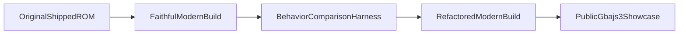

# @rkanoid Modernization Plan

## Goal

Create a modern, reproducible build of `@rkanoid` that:

- compiles with a current open-source GBA toolchain
- preserves original gameplay/visual behavior as the primary target
- gradually replaces fragile custom build/runtime pieces with well-supported open-source equivalents
- keeps the original shipped ROM as the validation reference

## Chosen strategy

Based on your answers, the implementation should be:

- `faithful-first`
- with `broad library adoption`, but only after a faithful baseline exists

That means the work should happen in two tracks:

## Recommended technical direction

### Base toolchain

Target a standard modern GBA stack built around:

- `devkitARM` / GCC-style ARM bare-metal toolchain
- `mGBA` as the primary validation/debug emulator
- `gbajs3` only as a showcase/distribution layer

### Open-source library adoption path

Use external libraries in this order:

1. `devkitARM` / `libgba` for standardized build/runtime headers and linker expectations
2. `grit` for documented, reproducible asset generation from preserved BMP sources
3. selective `tonc` helpers only where they clearly reduce risk or replace fragile handwritten boilerplate
4. avoid full framework rewrites or engine-style migration in the first implementation

References gathered during research:

- [devkitARM](https://devkitpro.org/wiki/devkitARM)
- [libgba](https://github.com/devkitPro/libgba)
- [Tonc setup docs](https://gbadev.net/tonc/setup.html)
- [grit manual](https://www.coranac.com/man/grit/html/grit.htm)
- [grit source](https://github.com/devkitPro/grit)
- [mGBA](https://mgba.io/)
- [gba-toolchain (CMake)](https://github.com/felixjones/gba-toolchain)
- [meson-gba](https://github.com/LunarLambda/meson-gba)
- [gba-bootstrap](https://github.com/AntonioND/gba-bootstrap)
- [gbajs3](https://github.com/thenick775/gbajs3)
- [awesome-gbadev](https://github.com/gbadev-org/awesome-gbadev)

## Implementation phases

## Phase 1: Stabilize the faithful lane

Use `[@rkanoid/build/faithful/work]( /Users/benoror/code/benoror/gbadev/@rkanoid/build/faithful/work )` as the truth-seeking lane until visuals and gameplay match the original ROM closely enough.

Primary fixes to complete there:

- keep the corrected `.data` copy path in `[start_gnu.s]( /Users/benoror/code/benoror/gbadev/@rkanoid/build/faithful/work/start_gnu.s )`
- keep the reconstructed `gameover` asset generated from preserved BMP sources
- keep `volatile` MMIO/OAM/VRAM macros in `[regs.h]( /Users/benoror/code/benoror/gbadev/@rkanoid/build/faithful/work/regs.h )`
- keep `sprintf()` removed from `[juego.c]( /Users/benoror/code/benoror/gbadev/@rkanoid/build/faithful/work/juego.c )`
- continue debugging the remaining graphics mismatch with the original ROM

Highest-priority remaining root causes to test in this lane:

- DMA transfer-size semantics for sprite/background uploads
- OAM range overrun (`<=128` vs `<128`)
- exact ROM asset-layout assumptions in `[demo.c]( /Users/benoror/code/benoror/gbadev/@rkanoid/current/demo.c )`
- compiler optimization effects on hardware-facing code paths

Success criteria:

- gameplay background matches the original ROM
- paddle/ball/HUD sprites all render correctly
- title/menu/gameplay flow visually matches the original well enough to use as a reference build

## Phase 2: Build a reproducible modern toolchain lane

Once faithful behavior is good enough, create a clean modern project structure under a new implementation lane such as:

- `[@rkanoid/build/refactor/]( /Users/benoror/code/benoror/gbadev/@rkanoid/build )` or a future `[@rkanoid/current-modern/]( /Users/benoror/code/benoror/gbadev/@rkanoid )`

This lane should:

- stop carrying temporary experiment-only patches
- use a documented modern build entrypoint
- preserve original source files as references instead of editing them in place

Planned build system direction:

- first use a straightforward GCC/Make path
- then consider a cleaner public build system like `meson-gba` or `gba-toolchain` only after the ROM is behaviorally stable

## Phase 3: Replace fragile custom runtime pieces with open-source equivalents

After a stable faithful result exists, refactor module-by-module.

### Startup/runtime

Replace handwritten bootstrap/linker pieces only when behavior is proven equivalent.

Candidates:

- current custom GNU startup in `[start_gnu.s]( /Users/benoror/code/benoror/gbadev/@rkanoid/build/faithful/work/start_gnu.s )`
- linker script in `[linker.ld]( /Users/benoror/code/benoror/gbadev/@rkanoid/build/faithful/work/linker.ld )`

Preferred direction:

- migrate toward standardized `devkitARM`/`libgba` conventions where doing so does not reintroduce behavioral drift

### Hardware helpers

Refactor `[regs.h]( /Users/benoror/code/benoror/gbadev/@rkanoid/current/regs.h )` into a small compatibility layer.

Potential end state:

- keep only game-specific helpers (`fade_in`, `fade_out`, etc.) locally
- replace raw duplicated register boilerplate with standardized headers or well-scoped wrappers
- selectively adopt `tonc` idioms where they simplify DMA/OAM/BG setup without rewriting gameplay logic

### Asset pipeline

This is one of the best candidates for open-source adoption.

Current state:

- the project depends on preserved `.raw` / `.pal` blobs and old assembler `INCBIN` assumptions
- preserved BMP sources exist in `[@rkanoid/current/proyecto/]( /Users/benoror/code/benoror/gbadev/@rkanoid/current/proyecto )` and `[backup_t]( /Users/benoror/code/benoror/gbadev/@rkanoid/current/proyecto/backup_t )`

Refactor target:

- introduce a documented generation path using `grit`
- preserve the generated `.raw` / `.pal` outputs initially for diffability
- make `sprites`, `bg`, `titulo`, `dream`, `fin`, `gameover` regeneration reproducible from BMP inputs

### Code structure

After the build and assets are stable, modernize structure with minimal gameplay drift:

- stop `#include`-ing `.c` files into other `.c` files
- split declarations and definitions into headers and compilation units
- isolate game logic from hardware/bootstrap code
- keep original preserved sources under `current/` and `legacy/` untouched as historical references

## Phase 4: Validation harness

Formalize comparison against the original shipped ROM.

Reference artifacts:

- original: `[public/roms/@rkanoid LATEST - DEMO.gba]( /Users/benoror/code/benoror/gbadev/public/roms/@rkanoid%20LATEST%20-%20DEMO.gba )`
- faithful: `[public/roms/@rkanoid FAITHFUL - COMPARISON.gba]( /Users/benoror/code/benoror/gbadev/public/roms/@rkanoid%20FAITHFUL%20-%20COMPARISON.gba )`
- modern: `[public/roms/@rkanoid MODERN - RECOMPILED.gba]( /Users/benoror/code/benoror/gbadev/public/roms/@rkanoid%20MODERN%20-%20RECOMPILED.gba )`

Comparison checklist:

- title screen timing and visuals
- menu sprites and cursor behavior
- gameplay background correctness
- paddle, ball, HUD sprite correctness
- frame pacing during intro and gameplay
- level progression, bonuses, collisions

If possible later:

- add mGBA-driven scripted regression capture (screenshots / savestate points)
- treat `gbajs3` as a human-facing showcase, not the primary correctness oracle

## Phase 5: Public showcase cleanup

Once the modernized build is behaviorally good enough:

- make the faithful or refactored ROM the default in `[public/index.html]( /Users/benoror/code/benoror/gbadev/public/index.html )`
- keep `Original`, `Faithful`, and `Modern` launchers for transparency
- document which ROM is the authoritative preservation build in `[public/README.md]( /Users/benoror/code/benoror/gbadev/public/README.md )`
- if needed, keep `gbajs3` patched for auto-loading showcase ROMs, but avoid coupling those patches to the native preservation build

## Immediate next implementation tasks

1. Continue faithful-lane graphics debugging in `[@rkanoid/build/faithful/work]( /Users/benoror/code/benoror/gbadev/@rkanoid/build/faithful/work )` with focus on DMA counts, OAM range, and remaining hardware-write deltas.
2. Introduce a reproducible asset regeneration script using preserved BMPs and `grit`-style outputs, starting with the assets already proven reconstructable (`bg`, `sprites`, `titulo`, `gameover`).
3. Once the faithful lane is visually stable, branch a cleaner `current-modern` implementation lane that starts adopting standardized open-source runtime/build pieces.
4. Keep updating the web showcase only after native ROM behavior is understood and stable.

