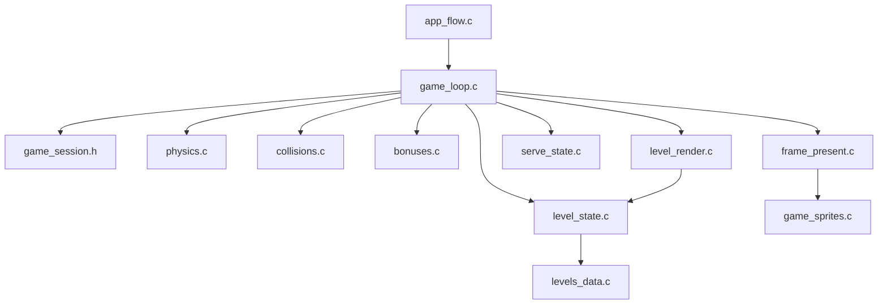

# RKanoid Next Refactor Plan

## Goal

Refactor the post-migration `@rkanoid/current-modern` code so complexity stops re-accumulating in `game_loop.c` and `levels_runtime.c`, while keeping the ROM behavior stable.

## Current Hotspots

- `[@rkanoid/current-modern/game_loop.c](@rkanoid/current-modern/game_loop.c)`: still owns frame flow, collision orchestration, bonus mutation, player-turn handling, and presentation decisions.
- `[@rkanoid/current-modern/levels_runtime.c](@rkanoid/current-modern/levels_runtime.c)`: still mixes mutable level state, background-map composition, and VRAM upload.
- `[@rkanoid/current-modern/levels_data.c](@rkanoid/current-modern/levels_data.c)`: now data-driven, but increasingly difficult to maintain by hand.
- `[@rkanoid/current-modern/game_sprites.c](@rkanoid/current-modern/game_sprites.c)`: clean enough for now, but still combines HUD, ball, paddle, and bonus sprite policy in one file.

## Recommended Sequence

1. Split `game_loop.c` by responsibility.
2. Introduce a `GameSession` state object.
3. Split `levels_runtime.c` into logical state vs rendering.
4. Lightly separate `game_sprites.c` by purpose if needed after step 1.
5. Prepare `levels_data.c` for generation from a source format.

## Target Architecture

## Phase 1: Split `game_loop.c`

Create smaller implementation files while preserving the current data structures and signatures as much as possible.

- Move world-bounds and paddle movement rules out of `[@rkanoid/current-modern/game_loop.c](@rkanoid/current-modern/game_loop.c)` into a `physics.c` or `movement.c` module.
- Move brick-hit resolution and paddle collision into `collisions.c`.
- Move falling-bonus update and collection into `bonuses.c`.
- Move serve-only flow out of `game_loop.c` into `serve_state.c`.
- Keep `RunGame()` as the orchestrator that sequences these helpers.

Implementation boundary suggestion:

- `[@rkanoid/current-modern/game_loop.c](@rkanoid/current-modern/game_loop.c)`: top-level round/level loop only
- new `physics.c`: bounds, paddle speed, clamp, per-frame movement
- new `collisions.c`: paddle/block collision and hit resolution
- new `bonuses.c`: active bonus updates and collection rules
- new `serve_state.c`: pre-launch paddle/ball behavior

## Phase 2: Add `GameSession`

Introduce a single struct to prevent scalar game state from being manually threaded through the loop.

Suggested contents:

- `lives`
- `score`
- `level`
- `activePlayer`
- current `levelTileMap`
- possibly `frameDirection` if that remains presentation-facing

Files to touch:

- `[@rkanoid/current-modern/game_state.h](@rkanoid/current-modern/game_state.h)`
- `[@rkanoid/current-modern/game_loop.c](@rkanoid/current-modern/game_loop.c)`
- any new gameplay modules from Phase 1

This should reduce coupling between helpers and make later testing easier.

## Phase 3: Split `levels_runtime.c`

Separate logical level-state ownership from rendering/upload behavior.

Proposed split:

- `level_state.c`: block reset, level seed application, bonus-slot assignment, level-cleared queries
- `level_render.c`: compose background tile map, apply shield floor tiles, upload background map to VRAM

Files to touch:

- `[@rkanoid/current-modern/levels_runtime.c](@rkanoid/current-modern/levels_runtime.c)`
- `[@rkanoid/current-modern/levels_runtime.h](@rkanoid/current-modern/levels_runtime.h)`
- new `level_state.c`, `level_render.c`, and possibly matching headers

This makes it easier to change rendering policy later without touching gameplay-owned block state.

## Phase 4: Revisit `game_sprites.c`

Only after the game-loop split is stable, decide whether `game_sprites.c` should be further divided.

Suggested split if it starts growing again:

- `hud_sprites.c`: score/life/level digits
- `ball_sprites.c`: ball and trail rendering
- `paddle_sprites.c`: paddle layout and player variants
- `bonus_sprites.c`: falling bonus sprite pair handling

If the file remains small and stable after earlier phases, this step can be skipped.

## Phase 5: Prepare `levels_data.c` For Generation

The data model is already much better than the old `PropNivel*` functions, but hand-maintaining large static tables will get expensive.

Plan:

- Define a simple source format for level seeds and tile maps.
- Add a generator that emits C tables or emits an intermediate format consumed by `levels_data.c`.
- Keep generated output deterministic so diffs stay reviewable.

Candidate inputs:

- `[@rkanoid/current-modern/blocks.txt](@rkanoid/current-modern/blocks.txt)` as a historical note only, not as the final format
- a new text/CSV/Python-authored source under `project/` or `tools/`

## Verification Strategy

After each phase:

- rebuild with `make clean && make`
- verify asset rebuild still works with `make assets`
- smoke-test title/menu flow
- smoke-test level 1 gameplay
- verify one shield, one comet, one long-paddle, one extra-life, and one big-ball pickup
- verify two-player handoff still works

For Phases 1 through 3, prefer one behavior-preserving refactor slice at a time rather than combining module moves with logic rewrites.

## Safest First Slice

Start with Phase 1 plus Phase 2 only:

- split `game_loop.c` into smaller modules
- add `GameSession`
- do not change level rendering structure yet

That gives the biggest readability win with the least architectural churn. Later phases can then build on clearer gameplay boundaries.