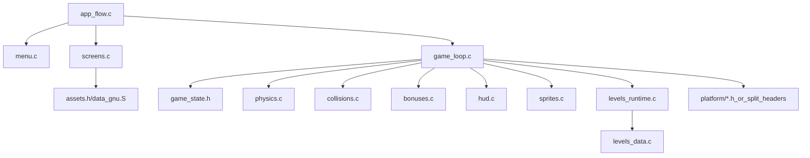

# RKanoid Current-Modern Refactor Plan

## Scope

This plan targets only `[@rkanoid/current-modern](@rkanoid/current-modern)` and its adjacent build/docs references. The goal is to create a new refactor lane that stays behavior-preserving while making the codebase easier to understand, rename, and evolve.

## Key Pressure Points

- `[@rkanoid/current-modern/juego.c](@rkanoid/current-modern/juego.c)`: `RunGame()` is the main complexity sink. It mixes level transitions, life reset, two-player flow, input, simulation, collision resolution, bonuses, HUD, sprite updates, and background refresh.
- `[@rkanoid/current-modern/niveles.c](@rkanoid/current-modern/niveles.c)`: mixes authored level data, runtime block state initialization, block-map selection, and tilemap presentation.
- `[@rkanoid/current-modern/demo.c](@rkanoid/current-modern/demo.c)`: mixes app flow, menu logic, repeated full-screen background presentation, and raw asset naming.
- `[@rkanoid/current-modern/regs.h](@rkanoid/current-modern/regs.h)`: bundles hardware registers, DMA, input, waits, fades, and audio helpers.

## Proposed End-State Module Shape

## Phase 0: Baseline And Naming Inventory

- Freeze the current behavior contract for the new lane before deep edits.
- Record the current translation/naming map from `[@rkanoid/current-modern/RENAMES.md](@rkanoid/current-modern/RENAMES.md)` and extend it with remaining file names, asset names, comments, and identifiers.
- Build a rename ledger covering:
  - `juego.c` -> `gameplay.c` or `game_loop.c`
  - `niveles.c` -> `levels.c` or a split into `levels_data.c` + `levels_runtime.c`
  - `bloques.txt` -> `blocks.txt`
  - asset symbol/file names such as `titulo` -> `title`, `fin` -> `ending`, `mesias` -> `shield`
- Preserve aliases temporarily where useful so the lane can compile during the transition.

## Phase 1: Safe Translation Pass

Start with behavior-neutral renames and documentation cleanup.

- Rename remaining Spanish-oriented files and update all references in:
  - `[@rkanoid/current-modern/Makefile](@rkanoid/current-modern/Makefile)`
  - `[@rkanoid/current-modern/README.md](@rkanoid/current-modern/README.md)`
  - `[@rkanoid/current-modern/RENAMES.md](@rkanoid/current-modern/RENAMES.md)`
  - assembler/data references in `[@rkanoid/current-modern/data_gnu.S](@rkanoid/current-modern/data_gnu.S)`
  - asset generation script `[@rkanoid/current-modern/tools/rebuild_assets.py](@rkanoid/current-modern/tools/rebuild_assets.py)`
- Translate remaining public identifiers that still leak Spanish-era terminology, especially in:
  - `[@rkanoid/current-modern/levels.h](@rkanoid/current-modern/levels.h)`
  - `[@rkanoid/current-modern/assets.h](@rkanoid/current-modern/assets.h)`
  - `[@rkanoid/current-modern/juego.c](@rkanoid/current-modern/juego.c)`
  - `[@rkanoid/current-modern/niveles.c](@rkanoid/current-modern/niveles.c)`
- Update comments and docs to use the English names as the primary vocabulary.

## Phase 2: Low-Risk Simplification And DRY Wins

These changes should reduce noise without materially changing game behavior.

- In `[@rkanoid/current-modern/demo.c](@rkanoid/current-modern/demo.c)`, replace the repeated `ShowSplashScreen()` / `ShowTitleScreen()` / `ShowGameOverScreen()` / `ShowEndingScreen()` loading pattern with a shared full-screen presenter helper.
- In `[@rkanoid/current-modern/juego.c](@rkanoid/current-modern/juego.c)`, introduce named OAM slot constants and shared hide/offscreen helpers instead of scattered slot magic numbers.
- Replace duplicated level-map selection logic with a single `GetBlockMapForLevel()` helper shared between gameplay and level rendering.
- Consolidate duplicate constant definitions so `[@rkanoid/current-modern/levels.h](@rkanoid/current-modern/levels.h)` is the authoritative source instead of re-defining the same values inside `[@rkanoid/current-modern/niveles.c](@rkanoid/current-modern/niveles.c)`.
- Make `SetBallSprite()` and `SetPaddleSprite()` table-driven instead of branch-heavy, repeated OAM writes.

## Phase 3: Separate Concerns Without Rewriting Behavior

Extract boundaries first, keep global state if needed, and delay semantic changes.

- Split `[@rkanoid/current-modern/demo.c](@rkanoid/current-modern/demo.c)` into app flow, menu, and screen-presentation responsibilities.
- Split `[@rkanoid/current-modern/niveles.c](@rkanoid/current-modern/niveles.c)` into:
  - level data definitions
  - level initialization/runtime block setup
  - tilemap synchronization/presentation
- Split `[@rkanoid/current-modern/regs.h](@rkanoid/current-modern/regs.h)` into smaller platform-facing headers for MMIO definitions, DMA, input, fades, waits, and audio helpers.
- Introduce a small shared types header so gameplay/level code depends less directly on hardware definitions.

## Phase 4: Decompose The Game Loop

This is the highest-value and highest-risk refactor, so it should happen only after naming and low-risk cleanup are done.

- Turn `RunGame()` in `[@rkanoid/current-modern/juego.c](@rkanoid/current-modern/juego.c)` into an orchestrator rather than the owner of every rule.
- Extract helpers for:
  - level start/reset
  - serve state
  - paddle input
  - ball/world bounds
  - paddle collision
  - block collision
  - bonus update/collection
  - HUD/sprite presentation
- Replace `goto`-driven flow with explicit state or phase-based control so level advance, life reset, and two-player turn swap are easier to reason about.
- Move mutable runtime dimensions like ball size, paddle width, and shield floor into an explicit game/player runtime struct once the helper boundaries exist.

## Phase 5: Deep DRY And Data-Driven Cleanup

After structure is stable, remove the biggest duplication sources.

- Consolidate the four near-duplicate brick-hit branches into shared collision-resolution logic while preserving face-specific behavior.
- Centralize repeated bonus-consume/deactivate/hide patterns into one helper path.
- Replace the procedural `PropNivel1` through `PropNivel5` style setup in `[@rkanoid/current-modern/niveles.c](@rkanoid/current-modern/niveles.c)` with structured tables or generated level definitions.
- Consider generating level definitions from `[@rkanoid/current-modern/bloques.txt](@rkanoid/current-modern/bloques.txt)` after it is renamed and clarified, but only once the runtime behavior is stable.

## Verification Strategy

- Rebuild after each phase and keep the lane compiling continuously.
- Prefer small rename-only commits/steps before mixed rename+logic work.
- For each phase, verify:
  - the game boots
  - title/menu flow still works
  - level 1 gameplay matches current behavior
  - at least one bonus of each type still behaves correctly
  - two-player turn handoff still works
- For deeper phases, compare the resulting ROM behavior against the current-modern baseline, not just successful compilation.

## Recommended Execution Order

1. Phase 0 naming inventory
2. Phase 1 translation/file rename pass
3. Phase 2 low-risk simplification and DRY cleanup
4. Phase 3 module extraction
5. Phase 4 `RunGame()` decomposition
6. Phase 5 deep deduplication and data-driven levels

## Suggested First Implementation Slice

The safest first implementation slice for the new lane is:

- rename remaining Spanish-era files and asset symbols
- update docs and build references
- add named OAM slots and a shared level-map lookup helper
- deduplicate the repeated full-screen screen presenters

That slice produces visible readability gains immediately, keeps risk low, and sets up the later structural work cleanly.