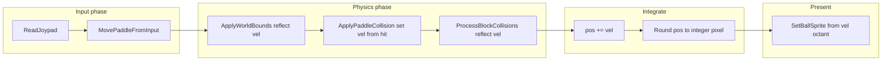

# Variable-angle ball with constant speed

## Goal

Replace the current **integer step** model (`FrameState.ballX/Y` + `stepX/stepY` in {-1,1}) with **sub-pixel position** and a **2D velocity vector** whose **Euclidean length is fixed** after paddle hits (and preserved across reflections, modulo small rounding correction). Paddle **hit offset** maps to **launch angle**; walls/bricks **reflect** the vector.

## Why fixed-point (recommended “optimal” for this codebase)

- **LUT-only** angles are easy on hardware but tuning and “true” constant speed are awkward.
- **Full float** in the hot loop is unnecessary on GBA and adds toolchain/runtime baggage.
- **Fixed-point** (`s32` with a chosen radix, e.g. **8.8**: 8 fractional bits) gives smooth motion, stable tuning, and fits naturally with your existing **integer pixel** collision tests by **rounding or truncating** world position to pixels each frame.

Add small typedefs/macros in a dedicated header (e.g. `[@rkanoid/current-modern/fixed_point.h](@rkanoid/current-modern/fixed_point.h)`) or extend `[@rkanoid/current-modern/gba_types.h](@rkanoid/current-modern/gba_types.h)`: `s32`, `FIX_SHIFT`, `FIX_ONE`, `FIX_FROM_INT`, `FIX_TO_INT`, `FIX_MUL` (saturating where needed).

## Data model

Extend `[@rkanoid/current-modern/game_state.h](@rkanoid/current-modern/game_state.h)` `FrameState` (or add a nested `BallMotion`):

| Field                  | Role                                                                                                                   |
| ---------------------- | ---------------------------------------------------------------------------------------------------------------------- |
| `ballPosX`, `ballPosY` | `s32`, Q8.8 world position (top-left of ball hitbox)                                                                   |
| `ballVelX`, `ballVelY` | `s32`, Q8.8 velocity (pixels per frame in fixed-point)                                                                 |
| `ballPixX`, `ballPixY` | `u16` (optional cache) **integer pixel** for OAM + legacy collision, updated each frame as `FIX_TO_INT(ballPosX)` etc. |

Keep `stepX`/`stepY` **only** if still needed for `[PresentGameplayFrame](@rkanoid/current-modern/frame_present.c)` / trail quadrants; better: **remove** them and derive presentation from velocity (see below).

**Speed constant**: pick `BALL_SPEED_FIX` so the legacy **45°** case matches today’s feel (today diagonal is effectively `(|dx|+|dy|)=2` pixels/frame in taxicab terms; calibrate so `sqrt(vx²+vy²)` in fixed-point matches your desired apparent speed, e.g. start from `vx=vy≈FIX_ONE/sqrt(2)` approximated by integer ratio like **181/256** of `FIX_ONE` per axis for unit diagonal — tune once).

## Motion pipeline (each frame)

Order in `[@rkanoid/current-modern/game_loop.c](@rkanoid/current-modern/game_loop.c)`: keep your current **resolve collisions then integrate** shape, but replace `ballX += stepX` with **fixed-point add**, then set **integer** `ballPixX/Y` for systems that still need pixels.

## Normalization (constant speed)

After any change to `ballVelX/Y` (paddle assign, wall reflect, brick reflect), enforce:

v_x^2 + v_y^2 = S^2 \quad \text{(in fixed-point)}

**Implementation without float** (pick one, in a tiny helper e.g. `ball_physics.c` or `physics.c`):

1. **Integer sqrt** on `s64` or scaled `u32` magnitude squared, then scale `(vx, vy)` by `S * FIX_ONE / mag` using fixed-point multiply (two passes or binary long division for div).
2. Or **precomputed unit vectors** for N paddle zones (LUT of `(vx,vy)` pairs already normalized to `S`) — fastest, less flexible.

Recommendation: **one generic `BallNormalizeVelocity()`** using fixed-point magnitude + scaling (easier to tune paddle curve than pure LUT).

## Paddle bounce (replace `[ApplyPaddleCollision](@rkanoid/current-modern/collisions.c)`)

Current logic picks among **four** discrete `(stepX, stepY)` patterns. Replace with:

1. Detect same **top/edge** hit regions you already use (same pixel predicates; optionally widen by ±0 if you move to sub-pixel, compare using **integer ball** from rounded position).
2. Compute **hit parameter** `t ∈ [-1,1]` from contact along paddle width (centered, clamped):
  - `t = (hitX - paddleCenterX) / (halfHitWidth)` in fixed-point.
3. Map `t` → **desired upward direction** (screen y down): e.g. angle band from **nearly vertical** at center to **more lateral** at edges, with **hard clamps** so you never launch too close to horizontal (avoids infinite side-wall ping-pong).
4. Set `(vx, vy)` from angle using **sin/cos approximations** (small Taylor, CORDIC, or **LUT per degree**) then **normalize** to `S`.

Long paddle: use same formula with **wider** `halfHitWidth` and possibly **softer** edge curvature (`t^3` shaping).

## Walls (`[ApplyWorldBounds](@rkanoid/current-modern/physics.c)`)

Replace `stepX = ±1` with:

- If hit left/right wall: `vx = -vx` (then normalize if rounding drifted).
- Ceiling: `vy = -vy` (normalize).
- Floor / death / shield: keep existing **game rules**; only change how **reflection** applies if you currently flip steps on shield line.

Compare bounds using **integer pixel** ball derived from fixed position (same thresholds as today).

## Bricks (`[ProcessBlockCollisions](@rkanoid/current-modern/collisions.c)`)

Keep **incoming-velocity gating** you added (still correct with vectors: use **incoming** `vx,vy` signs for face eligibility).

Replace per-axis `*stepX = ±1` with **physical reflection**:

- Vertical face: `vx = -vx`
- Horizontal face: `vy = -vy`

**Corner case** (both faces could fire in one frame for one block): resolve **one** reflection per frame using priority (e.g. smaller penetration along axis, or dominant incoming normal — document choice). This is separate from the two-block seam bug you already fixed.

After each brick resolution that changes velocity, **re-normalize** to `S`.

## Sprites (`[frame_present.c](@rkanoid/current-modern/frame_present.c)` / `[game_sprites.c](@rkanoid/current-modern/game_sprites.c)`)

Today `[SetBallSprite](@rkanoid/current-modern/game_sprites.c)` picks among **4** `direction` values from signs of `stepX/stepY`. Options:

- **Minimum**: map **8 octants** from `(vx, vy)` sign and `|vx| > |vy|` (still discrete art).
- **Better**: pass a **finer direction index** (16-way) or **angle bucket** and extend `kTrailSteps` / OAM layout if you want trails to match non-45° motion.

Phase 1 can keep **8-way** presentation without new art (interpolate between nearest two trail tables is optional polish).

## Serve (`[serve_state.c](@rkanoid/current-modern/serve_state.c)`)

While positioning before launch, keep using **integer** sprites as today; on transition to play:

- Initialize `ballPosX/Y` from integer `ballX/Y` shifted into Q8.8.
- Set initial `ballVelX/Y` from launch rule (could match first paddle hit policy or fixed “up-right” vector normalized to `S`).

## Files to touch (summary)

| File                                                         | Change                                                                         |
| ------------------------------------------------------------ | ------------------------------------------------------------------------------ |
| `[game_state.h](@rkanoid/current-modern/game_state.h)`       | Add fixed-point ball fields; deprecate `stepX/stepY` or repurpose              |
| New `fixed_point.h` / small `ball_motion.c`                  | Macros + `NormalizeVelocity`, optional `SetVelocityFromAngle`                  |
| `[physics.c](@rkanoid/current-modern/physics.c)`             | World bounds reflect `vx/vy`; optional sub-step if you later split integration |
| `[collisions.c](@rkanoid/current-modern/collisions.c)`       | Paddle vector assignment; brick vector reflection + corner rule                |
| `[game_loop.c](@rkanoid/current-modern/game_loop.c)`         | Integrate `pos += vel`; sync integer pixel                                     |
| `[frame_present.c](@rkanoid/current-modern/frame_present.c)` | Direction from velocity                                                        |
| `[serve_state.c](@rkanoid/current-modern/serve_state.c)`     | Init fixed-point state on launch                                               |
| `[bonuses.c](@rkanoid/current-modern/bonuses.c)`             | Any code using `frame.ballX` — use integer pixel field                         |

## Verification

- `make clean && make`; smoke **serve**, **wall**, **45°-like** baseline matches prior speed after calibration.
- **Paddle edges**: visibly different angles; **center**: nearly straight up.
- **Seam bricks**: no regression on adjacent-block edge case.
- **Trail comet** / big ball: still normalize after trail-induced brick behavior if that logic changes velocity.

## Risk note

Sub-pixel means **collision equality** on exact pixels can miss/skew by 1 pixel unless you always derive test position the same way (recommend: **single function** `Ball_GetPixelRect(frame, runtime, &x,&y,&w,&h)` used everywhere).